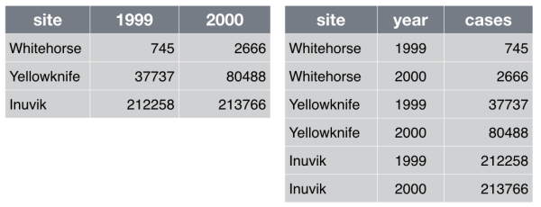

# Good Enough Practices for Scientific Computing

Greg Wilson1,
Jennifer Bryan2,
Karen Cranston3,
Justin Kitzes4,
Lex Nederbragt5,
Tracy K. Teal6

1) Software Carpentry Foundation / gvwilson@software-carpentry.org

2) University of British Columbia / jenny@stat.ubc.ca

3) Duke University / karen.cranston@duke.edu

4) University of California, Berkeley / jkitzes@berkeley.edu

5) University of Oslo / lex.nederbragt@ibv.uio.no

6) Data Carpentry / tkteal@datacarpentry.org

> **A PDF of this paper can be found at <http://arxiv.org/abs/1609.00037>.
> We would appreciate feedback of all kinds:
> please [email comments to the authors](mailto:gvwilson@software-carpentry.org?subject=comments on good enough practices).**

**Abstract**

We present a set of computing tools and techniques that every researcher
can and should adopt. These recommendations synthesize inspiration from
our own work, from the experiences of the thousands of people who have
taken part in Software Carpentry and Data Carpentry workshops over the
past six years, and from a variety of other guides. Our recommendations
are aimed specifically at people who are new to research computing.

**Author Summary**

Computers are now essential in all branches of science, but most
researchers are never taught the equivalent of basic lab skills for
research computing. As a result, they take days or weeks to do things
that could be done in minutes or hours, are often unable to reproduce
their own work (much less the work of others), and have no idea how
reliable their computational results are.

This paper presents a set of good computing practices that every
researcher can adopt regardless of their current level of technical
skill. These practices, which encompass data management, programming,
collaborating with colleagues, organizing projects, tracking work, and
writing manuscripts, are drawn from a wide variety of published sources,
from our daily lives, and from our work with volunteer organizations
that have delivered workshops to over 11,000 people since 2010.

## Introduction

Two years ago a group of researchers involved in Software
Carpentry[^1] and Data
Carpentry[^2] wrote a paper called "Best Practices for
Scientific Computing" [[wilson2014](#wilson2014)]. It was well received, but many
novices found its litany of tools and techniques intimidating. Also, by
definition, the "best" are a small minority. What practices are
comfortably within reach for the "rest"?

This paper therefore presents a set of "good enough" practices[^3] for
scientific computing, i.e., a minimum set of tools and techniques that
we believe every researcher can and should adopt. It draws inspiration
from many sources
[[gentzkow2014](#gentzkow2014), [noble2009](#noble2009), [brown2015](#brown2015), [wickham2014](#wickham2014), [kitzes2016](#kitzes2016), [sandve2013](#sandve2013), [hart2015](#hart2015)],
from our personal experience, and from the experiences of the thousands
of people who have taken part in Software Carpentry and Data Carpentry
workshops over the past six years.

Our intended audience is researchers who are working alone or with a
handful of collaborators on projects lasting a few days to a few months,
and who are ready to move beyond emailing themselves a spreadsheet named
`results-updated-3-revised.xlsx` at the end of the workday. A practice
is included in our list if large numbers of researchers use it, and
large numbers of people are *still* using it months after first trying
it out. We include the second criterion because there is no point
recommending something that people won't actually adopt.

Many of our recommendations are for the benefit of the collaborator
every researcher cares about most: their future self[^4]. Change is hard
and if researchers don't see those benefits quickly enough to justify
the pain, they will almost certainly switch back to their old way of
doing things. This rules out many practices, such as code review, that
we feel are essential for larger-scale development.

We organize our recommendations into the following topics:

-   Data Management: saving both raw and intermediate forms; documenting
    all steps; creating tidy data amenable to analysis.

-   Software: writing, organizing, and sharing scripts and programs used
    in an analysis.

-   Collaboration: making it easy for existing and new collaborators to
    understand and contribute to a project.

-   Project Organization: organizing the digital artifacts of a project
    to ease discovery and understanding.

-   Tracking Changes: recording how various components of your project
    change over time.

-   Manuscripts: writing manuscripts in a way that leaves an audit trail
    and minimizes manual merging of conflict.

### Acknowledgments

We are grateful to Arjun Raj (University of Pennsylvania), Steven
Haddock (Monterey Bay Aquarium Research Institute), Stephen Turner
(University of Virginia), Elizabeth Wickes (University of Illinois), and
Garrett Grolemund (RStudio) for their feedback on early versions of this
paper, to those who contributed during the outlining of the manuscript,
and to everyone involved in Data Carpentry and Software Carpentry for
everything they have taught us.

## Data Management

Data within a project may need to exist in various forms, ranging from
what first arrives to what is actually used for the primary analyses.
Our recommendations have two main themes. One is to work towards
ready-to-analyze data incrementally, documenting both the intermediate
data and the process. We also describe the key features of "tidy data",
which can be a powerful accelerator for analysis [[wickham2014](#wickham2014), [hart2015](#hart2015)].

1.  ***Save the raw data (1a)***.
    Where possible, save data as originally generated (i.e. by an
    instrument or from a survey). It is tempting to overwrite raw data
    files with cleaned-up versions, but faithful retention is essential
    for re-running analyses from start to finish; for recovery from
    analytical mishaps; and for experimenting without fear. Consider
    changing file permissions to read-only or using spreadsheet
    protection features, so it is harder to damage raw data by accident
    or to hand edit it in a moment of weakness.

    Some data will be impractical to manage in this way. For example,
    you should avoid making local copies of large, stable repositories.
    In that case, record the exact procedure used to obtain the raw
    data, as well as any other pertinent info, such as an official
    version number or the date of download.

2.  ***Create the data you wish to see in the
    world (1b)***. Create the dataset you
    *wish* you had received. The goal here is to improve machine and
    human readability, but *not* to do vigorous data filtering or add
    external information. Machine readability allows automatic
    processing using computer programs, which is important when others
    want to reuse your data. Specific examples of non-destructive
    transformations that we recommend at the beginning of analysis:

    *File formats*: Convert data from closed, proprietary formats to
    open, non-proprietary formats that ensure machine readability across
    time and computing setups [[illinois](#illinois)]. Good options include CSV for
    tabular data, JSON, YAML, or XML for non-tabular data such as
    graphs[^5], and HDF5 for certain kinds of structured data.

    *Variable names*: Replace inscrutable variable names and artificial
    data codes with self-explaining alternatives, e.g., rename variables
    called `name1` and `name2` to `personal_name` and `family_name`,
    recode the treatment variable from `1` vs. `2` to `untreated` vs.
    `treated`, and replace artificial codes for missing data, such as
    "-99", with `NA`s, a code used in most programming languages to
    indicate that data is "Not Available" [[white2013](#white2013)].

    *Filenames*: Store especially useful metadata as part of the
    filename itself, while keeping the filename regular enough for easy
    pattern matching. For example, a filename like
    `2016-05-alaska-b.csv` makes it easy for both people and programs to
    select by year or by location.

3.  ***Create analysis-friendly
    data (1c)***: Analysis can be much easier
    if you are working with so-called "tidy" data [[wickham2014](#wickham2014)]. Two key
    principles are:

    *Make each column a variable*: Don't cram two variables into one,
    e.g., "male\_treated" should be split into separate variables for
    sex and treatment status. Store units in their own variable or in
    metadata, e.g., "3.4" instead of "3.4kg".

    *Make each row an observation*: Data often comes in a wide format,
    because that facilitated data entry or human inspection. Imagine one
    row per field site and then columns for measurements made at each of
    several time points. Be prepared to gather such columns into a
    variable of measurements, plus a new variable for time point.
    Fig [fig:tidy] presents an example of such a transformation.

    [fig:tidy]

4.  ***Record all the steps used to process
    data (1d)***: Data manipulation is as
    integral to your analysis as statistical modelling and inference. If
    you do not document this step thoroughly, it is impossible for you,
    or anyone else, to repeat the analysis.

    The best way to do this is to write scripts for *every* stage of
    data processing. This might feel frustratingly slow, but you will
    get faster with practice. The immediate payoff will be the ease with
    which you can re-do data preparation when new data arrives. You can
    also re-use data preparation logic in the future for related
    projects.

    When scripting is not feasible, it's important to clearly document
    every manual action (what menu was used, what column was copied and
    pasted, what link was clicked, etc.). Often you can at least capture
    *what* action was taken, if not the complete *why*. For example,
    choosing a region of interest in an image is inherently interactive,
    but you can save the region chosen as a set of boundary coordinates.

5.  ***Anticipate the need to use multiple
    tables (1e)***: Raw data, even if tidy,
    is not necessarily complete. For example, the primary data table
    might hold the heart rate for individual subjects at rest and after
    a physical challenge, identified via a subject ID. Demographic
    variables, such as subject age and sex, are stored in a second table
    and will need to be brought in via merging or lookup. This will go
    more smoothly if subject ID is represented in a common format in
    both tables, e.g., always as "14025" versus "14,025" in one table
    and "014025" in another. It is generally wise to give each record or
    unit a unique, persistent key and to use the same names and codes
    when variables in two datasets refer to the same thing.

6.  ***Submit data to a reputable DOI-issuing repository so
    that others can access and cite
    it. (1f)*** Your data is as much a
    product of your research as the papers you write, and just as likely
    to be useful to others (if not more so). Sites such as
    Figshare[^6],
    Dryad[^7], and
    Zenodo[^8] allow others to find your work,
    use it, and cite it; we discuss licensing in
    Section [sec:collaboration] below. Follow your research community's
    standards for how to provide metadata. Note that there are two types
    of metadata: metadata about the dataset as a whole and metadata
    about the content within the dataset. If the audience is humans,
    write the metadata (the readme file) for humans. If the audience
    includes automatic metadata harvesters, fill out the formal metadata
    and write a good readme file for the humans [[wickes2015](#wickes2015)].

Taken in order, the recommendations above will produce intermediate data
files with increasing levels of cleanliness and task-specificity. An
alternative approach to data management would be to fold all data
management tasks into a monolithic procedure for data analysis, so that
intermediate data products are created "on the fly" and stored only in
memory, not saved as distinct files.

While the latter approach may be appropriate for projects in which very
little data cleaning or processing is needed, we recommend the explicit
creation and retention of intermediate products. Saving intermediate
files makes it easy to re-run *parts* of a data analysis pipeline, which
in turn makes it less onerous to revisit and improve specific data
processing tasks. Breaking a lengthy workflow into pieces makes it
easier to understand, share, describe, and modify.

## Software

If you or your group are creating tens of thousands of lines of software
for use by hundreds of people you have never met, you are doing software
engineering. If you're writing a few dozen lines now and again, and are
probably going to be its only user, you may not be doing engineering,
but you can still make things easier on yourself by adopting a few key
engineering practices. What's more, adopting these practices will make
it easier for people to understand and (re)use your code.

The core realization in these practices is that *readable*, *reusable*,
and *testable* are all side effects of writing *modular* code, i.e., of
building programs out of short, single-purpose functions with
clearly-defined inputs and outputs.

1.  ***Place a brief explanatory comment at the start of
    every program (2a)***, no matter how
    short it is. That comment should include at least one example of how
    the program is used: remember, a good example is worth a thousand
    words. Where possible, the comment should also indicate reasonable
    values for parameters. An example of such a comment is show below.

        Synthesize image files for testing circularity estimation algorithm.

        Usage: make_images.py -f fuzzing -n flaws -o output -s seed -v -w size

        where:
        -f fuzzing = fuzzing range of blobs (typically 0.0-0.2)
        -n flaws   = p(success) for geometric distribution of # flaws/sample (e.g. 0.5-0.8)
        -o output  = name of output file
        -s seed    = random number generator seed (large integer)
        -v         = verbose
        -w size    = image width/height in pixels (typically 480-800)

2.  ***Decompose programs into
    functions (2b)*** that are no more than
    one page (about 60 lines) long, do not use global variables
    (constants are OK), and take no more than half a dozen parameters.
    The key motivation here is to fit the program into the most limited
    memory of all: ours. Human short-term memory is famously incapable
    of holding more than about seven items at once [[miller1956](#miller1956)]. If we
    are to understand what our software is doing, we must break it into
    chunks that obey this limit, then create programs by combining these
    chunks.

3.  ***Be ruthless about eliminating
    duplication (2c)***. Write and re-use
    functions instead of copying and pasting source code, and use data
    structures like lists rather than creating lots of variables called
    `score1`, `score2`, `score3`, etc.

    The easiest code to debug and maintain is code you didn't actually
    write, so ***always search for well-maintained software
    libraries that do what you need (2d)***
    before writing new code yourself, and ***test libraries
    before relying on them (2e)***.

4.  ***Give functions and variables meaningful
    names (2f)***, both to document their
    purpose and to make the program easier to read. As a rule of thumb,
    the greater the scope of a variable, the more informative its name
    should be: while it's acceptable to call the counter variable in a
    loop `i` or `j`, the major data structures in a program should *not*
    have one-letter names. Remember to follow each language's
    conventions for names, such as `net_charge` for Python and
    `NetCharge` for Java.

    > **Tab Completion**
    >
    > Almost all modern text editors provide *tab completion*, so that
    > typing the first part of a variable name and then pressing the tab
    > key inserts the completed name of the variable. Employing this
    > means that meaningful longer variable names are no harder to type
    > than terse abbreviations.

5.  ***Make dependencies and requirements
    explicit. (2g)*** This is usually done on
    a per-project rather than per-program basis, i.e., by adding a file
    called something like `requirements.txt` to the root directory of
    the project, or by adding a "Getting Started" section to the
    `README` file.

6.  ***Do not comment and uncomment sections of code to
    control a program's behavior (2h)***,
    since this is error prone and makes it difficult or impossible to
    automate analyses. Instead, put if/else statements in the program to
    control what it does.

7.  ***Provide a simple example or test data
    set (2i)*** that users (including
    yourself) can run to determine whether the program is working and
    whether it gives a known correct output for a simple known input.
    Such a "build and smoke test" is particularly helpful when
    supposedly-innocent changes are being made to the program, or when
    it has to run on several different machines, e.g., the developer's
    laptop and the department's cluster.

8.  ***Submit code to a reputable DOI-issuing
    repository (2j)*** upon submission of
    paper, just as you do with data. Your software is as much a product
    of your research as your papers, and should be as easy for people to
    credit. DOIs for software are provided by
    Figshare[^9] and
    Zenodo[^10]. Zenodo integrates directly
    with GitHub.

## Collaboration

You may start working on projects by yourself or with a small group of
collaborators you already know, but you should design it to make it easy
for new collaborators to join. These collaborators might be new grad
students or postdocs in the lab, or they might be *you* returning to a
project that has been idle for some time. As summarized in
[[steinmacher2015](#steinmacher2015)], you want to make it easy for people to set up a local
workspace so that they *can* contribute, help them find tasks so that
they know *what* to contribute, and make the contribution process clear
so that they know *how* to contribute. You also want to make it easy for
people to give you credit for your work.

1.  ***Create an overview of your
    project. (3a)*** Have a short file in the
    project's home directory that explains the purpose of the project.
    This file (generally called `README`, `README.txt`, or something
    similar) should contain the project's title, a brief description,
    up-to-date contact information, and an example or two of how to run
    various cleaning or analysis tasks. It is often the first thing
    users of your project will look at, so make it explicit that you
    welcome contributors and point them to ways they can help.

    You should also create a `CONTRIBUTING` file that describes what
    people need to do in order to get the project going and contribute
    to it, i.e., dependencies that need to be installed, tests that can
    be run to ensure that software has been installed correctly, and
    guidelines or checklists that your project adheres to.

2.  ***Create a shared public "to-do"
    list (3b)***. This can be a plain text
    file called something like `notes.txt` or `todo.txt`, or you can use
    sites such as GitHub or Bitbucket to create a new *issue* for each
    to-do item. (You can even add labels such as "low hanging fruit" to
    point newcomers at issues that are good starting points.) Whatever
    you choose, describe the items clearly so that they make sense to
    newcomers.

3.  ***Make the license
    explicit. (3c)*** Have a `LICENSE` file
    in the project's home directory that clearly states what license(s)
    apply to the project's software, data, and manuscripts. Lack of an
    explicit license does not mean there isn't one; rather, it implies
    the author is keeping all rights and others are not allowed to
    re-use or modify the material.

    We recommend Creative Commons licenses for data and text, either
    CC-0[^11] (the "No Rights Reserved"
    license) or CC-BY[^12] (the "Attribution"
    license, which permits sharing and reuse but requires people to give
    appropriate credit to the creators). For software, we recommend a
    permissive open source license such as the MIT, BSD, or Apache
    license [[stlaurent2004](#stlaurent2004)].

    > **What Not To Do**
    >
    > We recommend *against* the "no commercial use" variations of the
    > Creative Commons licenses because they may impede some forms of
    > re-use. For example, if a researcher in a developing country is
    > being paid by her government to compile a public health report,
    > she will be unable to include your data if the license says
    > "non-commercial". We recommend permissive software licenses rather
    > than the GNU General Public License (GPL) because it is easier to
    > integrate permissively-licensed software into other projects, see
    > chapter three in [[stlaurent2004](#stlaurent2004)].

4.  ***Make the project
    citable (3d)*** by including a `CITATION`
    file in the project's home directory that describes how to cite this
    project as a whole, and where to find (and how to cite) any data
    sets, code, figures, and other artifacts that have their own DOIs.
    The example below shows the `CITATION` file for the
    Ecodata Retriever[^13]; for an example of
    a more detailed `CITATION` file, see the one for the
    khmer[^14] project.

        Please cite this work as:

        Morris, B.D. and E.P. White. 2013. "The EcoData Retriever:
        improving access to existing ecological data." PLOS ONE 8:e65848.
        http://doi.org/doi:10.1371/journal.pone.0065848

## Project Organization

Organizing the files that make up a project in a logical and consistent
directory structure will help you and others keep track of them. Our
recommendations for doing this are drawn primarily from [[noble2009](#noble2009), [gentzkow2014](#gentzkow2014)].

1.  ***Put each project in its own directory, which is named
    after the project. (4a)*** Like deciding
    when a chunk of code should be made a function, the ultimate goal of
    dividing research into distinct projects is to help you and others
    best understand your work. Some researchers create a separate
    project for each manuscript they are working on, while others group
    all research on a common theme, data set, or algorithm into a single
    project.

    As a rule of thumb, divide work into projects based on the overlap
    in data and code files. If two research efforts share no data or
    code, they will probably be easiest to manage independently. If they
    share more than half of their data and code, they are probably best
    managed together, while if you are building tools that are used in
    several projects, the common code should probably be in a project of
    its own.

2.  ***Put text documents associated with the project in the
    `doc` directory. (4b)*** This includes
    files for manuscripts, documentation for source code, and/or an
    electronic lab notebook recording your experiments. Subdirectories
    may be created for these different classes of files in large
    projects.

3.  ***Put raw data and metadata in a `data` directory, and
    files generated during cleanup and analysis in a `results`
    directory (4c)***, where "generated
    files" includes intermediate results, such as cleaned data sets or
    simulated data, as well as final results such as figures and tables.

    The `results` directory will *usually* require additional
    subdirectories for all but the simplest projects. Intermediate files
    such as cleaned data, statistical tables, and final
    publication-ready figures or tables should be separated clearly by
    file naming conventions or placed into different subdirectories;
    those belonging to different papers or other publications should be
    grouped together.

4.  ***Put project source code in the `src`
    directory. (4d)*** `src` contains all of
    the code written for the project. This includes programs written in
    interpreted languages such as R or Python; those written compiled
    languages like Fortran, C++, or Java; as well as shell scripts,
    snippets of SQL used to pull information from databases; and other
    code needed to regenerate the results.

    This directory may contain two conceptually distinct types of files
    that should be distinguished either by clear file names or by
    additional subdirectories. The first type are files or groups of
    files that perform the core analysis of the research, such as data
    cleaning or statistical analyses. These files can be thought of as
    the "scientific guts" of the project.

    The second type of file in `src` is controller or driver scripts
    that combine the core analytical functions with particular
    parameters and data input/output commands in order to execute the
    entire project analysis from start to finish. A controller script
    for a simple project, for example, may read a raw data table, import
    and apply several cleanup and analysis functions from the other
    files in this directory, and create and save a numeric result. For a
    small project with one main output, a single controller script
    should be placed in the main `src` directory and distinguished
    clearly by a name such as "runall".

5.  ***Put external scripts, or compiled programs in the
    `bin` directory (4e)***. `bin` contains
    scripts that are brought in from elsewhere, and executable programs
    compiled from code in the `src` directory[^15]. Projects that have
    neither will not require `bin`.

    > **Scripts vs. Programs**
    >
    > We use the term "script" to mean "something that is executed
    > directly as-is", and "program" to mean "something that is
    > explicitly compiled before being used". The distinction is more
    > one of degree than kind—libraries written in Python are actually
    > compiled to bytecode as they are loaded, for example—so one other
    > way to think of it is "things that are edited directly" and
    > "things that are not".

6.  ***Name all files to reflect their content or
    function. (4f)*** For example, use names
    such as `bird_count_table.csv`, `manuscript.md`, or
    `sightings_analysis.py`. Do *not* using sequential numbers (e.g.,
    `result1.csv`, `result2.csv`) or a location in a final manuscript
    (e.g., `fig_3_a.png`), since those numbers will almost certainly
    change as the project evolves.

The diagram below provides a concrete example of how a simple project
might be organized following these recommendations:

    .
    |-- CITATION
    |-- README
    |-- LICENSE
    |-- requirements.txt
    |-- data
    |   -- birds_count_table.csv
    |-- doc
    |   -- notebook.md
    |   -- manuscript.md
    |   -- changelog.txt
    |-- results
    |   -- summarized_results.csv
    |-- src
    |   -- sightings_analysis.py
    |   -- runall.py

The root directory contains a `README` file that provides an overview of
the project as a whole, a `CITATION` file that explains how to reference
it, and a `LICENSE` file that states the licensing. The `data` directory
contains a single CSV file with tabular data on bird counts
(machine-readable metadata could also be included here). The `src`
directory contains `sightings_analysis.py`, a Python file containing
functions to summarize the tabular data, and a controller script
`runall.py` that loads the data table, applies functions imported from
`sightings_analysis.py`, and saves a table of summarized results in the
`results` directory.

This project doesn't have a `bin` directory, since it does not rely on
any compiled software. The `doc` directory contains two text files
written in Markdown, one containing a running lab notebook describing
various ideas for the project and how these were implemented and the
other containing a running draft of a manuscript describing the project
findings.

## Keeping Track of Changes

Keeping track of changes that you or your collaborators make to data and
software is a critical part of research. Being able to reference or
retrieve a specific version of the entire project aids in
reproducibility for you leading up to publication, when responding to
reviewer comments, and when providing supporting information for
reviewers, editors, and readers.

We believe that the best tools for tracking changes are the version
control systems that are used in software development, such as Git,
Mercurial, and Subversion. They keep track of what was changed in a file
when and by whom, and synchronize changes to a central server so that
many users can manage changes to the same set of files.

Although all of the authors use version control daily for all of their
projects, we recognize that many newcomers to computational science find
version control to be one of the more difficult practices to adopt. We
therefore recommend that projects adopt *either* a systematic manual
approach for managing changes *or* version control in its full glory.

Whatever system you chose, we recommend that you use it in the following
way:

1.  ***Back up (almost) everything created by a human being
    as soon as it is created. (5a)*** This
    includes scripts and programs of all kinds, software packages that
    your project depends on, and documentation. A few exceptions to this
    rule are discussed below.

2.  ***Keep changes
    small. (5b)*** Each change should not be
    so large as to make the change tracking irrelevant. For example, a
    single change such as "Revise script file" that adds or changes
    several hundred lines is likely too large, as it will not allow
    changes to different components of an analysis to be investigated
    separately. Similarly, changes should not be broken up into pieces
    that are too small. As a rule of thumb, a good size for a single
    change is a group of edits that you could imagine wanting to undo in
    one step at some point in the future.

3.  ***Share changes
    frequently. (5c)*** Everyone working on
    the project should share and incorporate changes from others on a
    regular basis. Do not allow individual investigator's versions of
    the project repository to drift apart, as the effort required to
    merge differences goes up faster than the size of the difference.
    This is particularly important for the manual versioning procedure
    describe below, which does not provide any assistance for merging
    simultaneous, possibly conflicting, changes.

4.  ***Create, maintain, and use a checklist for saving and
    sharing changes to the project. (5d)***
    The list should include writing log messages that clearly explain
    any changes, the size and content of individual changes, style
    guidelines for code, updating to-do lists, and bans on committing
    half-done work or broken code. See [[gawande2011](#gawande2011)] for more on the
    proven value of checklists.

5.  ***Store each project in a folder that is mirrored off
    the researcher's working machine (5e)***
    using a system such as Dropbox or a remote version control
    repository such as GitHub. Synchronize that folder at least daily.
    It may take a few minutes, but that time is repaid the moment a
    laptop is stolen or its hard drive fails.

### Manual Versioning

Our first suggested approach, in which everything is done by hand, has
two additional parts:

1.  ***Add a file called `CHANGELOG.txt` to the project's
    `docs` subfolder (5f)***, and make dated
    notes about changes to the project in this file in reverse
    chronological order (i.e., most recent first). This file is the
    equivalent of a lab notebook, and should contain entries like those
    shown below.

        ## 2016-04-08

        * Switched to cubic interpolation as default.
        * Moved question about family's TB history to end of questionnaire.

        ## 2016-04-06

        * Added option for cubic interpolation.
        * Removed question about staph exposure (can be inferred from blood test results).

2.  ***Copy the entire project whenever a significant change
    has been made (5g)*** (i.e., one that
    materially affects the results), and store that copy in a sub-folder
    whose name reflects the date in the area that's being synchronized.
    This approach results in projects being organized as shown below:

        .
        |-- project_name
        |   -- current
        |       -- ...project content as described earlier...
        |   -- 2016-03-01
        |       -- ...content of 'current' on Mar 1, 2016
        |   -- 2016-02-19
        |       -- ...content of 'current' on Feb 19, 2016

    Here, the `project_name` folder is mapped to external storage (such
    as Dropbox), `current` is where development is done, and other
    folders within `project_name` are old versions.

    > **Data is Cheap, Time is Expensive**
    >
    > Copying everything like this may seem wasteful, since many files
    > won't have changed, but consider: a terabyte hard drive costs
    > about $50 retail, which means that 50 GByte costs less than a
    > latte. Provided large data files are kept out of the backed-up
    > area (discussed below), this approach costs less than the time it
    > would take to select files by hand for copying.

This manual procedure satisfies the requirements outlined above without
needing any new tools. If multiple researchers are working on the same
project, though, they will need to coordinate so that only a single
person is working on specific files at any time. In particular, they may
wish to create one change log file per contributor, and to merge those
files whenever a backup copy is made.

### Version Control Systems

What the manual process described above requires most is
self-discipline. The version control tools that underpin our second
approach—the one all authors use for their projects—don't just
accelerate the manual process: they also automate some steps while
enforcing others, and thereby require less self-discipline for more
reliable results.

1.  ***Use a version control
    system (5h)***, to manage changes to a
    project.

Box 2 briefly explains how version control systems work. It's hard to
know what version control tool is most widely used in research today,
but the one that's most talked about is undoubtedly
Git[^16]. This is largely because of
GitHub[^17], a popular hosting site that
combines the technical infrastructure for collaboration via Git with a
modern web interface. GitHub is free for public and open source projects
and for users in academia and nonprofits.
GitLab[^18] is a well-regarded alternative
that some prefer, because the GitLab platform itself is free and open
source.

For those who find Git's command-line syntax inconsistent and confusing,
Mercurial[^19] is a good choice;
Bitbucket[^20] provides free hosting for both
Git and Mercurial repositories, but does not have nearly as many
scientific users.

### What Not to Put Under Version Control

The benefits of version control systems don't apply equally to all file
types. In particular, version control can be more or less rewarding
depending on file size and format. First, file comparison in version
control systems is optimized for plain text files, such as source code.
The ability to see so-called "diffs" is one of the great joys of version
control. Unfortunately, Microsoft Office files (like the `.docx` files
used by Word) or other binary files, e.g., PDFs, can be stored in a
version control system, but it is not possible to pinpoint specific
changes from one version to the next. Tabular data (such as CSV files)
can be put in version control, but changing the order of the rows or
columns will create a big change for the version control system, even if
the data itself has not changed.

Second, raw data should not change, and therefore should not require
version tracking. Keeping intermediate data files and other results
under version control is also not necessary if you can re-generate them
from raw data and software. However, if data and results are small, we
still recommend versioning them for ease of access by collaborators and
for comparison across versions.

Third, today's version control systems are not designed to handle
megabyte-sized files, never mind gigabytes, so large data or results
files should not be included. (As a benchmark for "large", the limit for
an individual file on GitHub is 100MB.) Some emerging hybrid systems
such as Git LFS[^21] put textual notes under
version control, while storing the large data itself in a remote server,
but these are not yet mature enough for us to recommend.

> **Inadvertent Sharing**
>
> Researchers dealing with data subject to legal restrictions that
> prohibit sharing (such as medical data) should be careful not to put
> data in public version control systems. Some institutions may provide
> access to private version control systems, so it is worth checking
> with your IT department.
>
> Additionally, be sure not to unintentionally place security
> credentials, such as passwords and private keys, in a version control
> system where it may be accessed by others.

## Manuscripts

An old joke says that doing the research is the first 90% of any
project; writing up is the other 90%. While writing is rarely addressed
in discussions of scientific computing, computing has changed scientific
writing just as much as it has changed research.

A common practice in academic writing is for the lead author to send
successive versions of a manuscript to coauthors to collect feedback,
which is returned as changes to the document, comments on the document,
plain text in email, or a mix of all three. This results in a lot of
files to keep track of, and a lot of tedious manual labor to merge
comments to create the next master version.

Instead of an email-based workflow, we recommend mirroring good
practices for managing software and data to make writing scalable,
collaborative, and reproducible. As with our recommendations for version
control in general, we suggest that groups choose one of two different
approaches for managing manuscripts. The goals of both are to:

-   Ensure that text is accessible to yourself and others now and in the
    future by making a single master document that is available to all
    coauthors at all times.

-   Reduce the chances of work being lost or people overwriting each
    other's work.

-   Make it easy to track and combine contributions from multiple
    collaborators.

-   Avoid duplication and manual entry of information, particularly in
    constructing bibliographies, tables of contents, and lists.

-   Make it easy to regenerate the final published form (e.g., a PDF)
    and to tell if it is up to date.

-   Make it easy to share that final version with collaborators and to
    submit it to a journal.

> **The First Rule Is…**
>
> The workflow you choose is less important than having all authors
> agree on the workflow *before* writing starts. Make sure to also agree
> on a single method to provide feedback, be it an email thread or
> mailing list, an issue tracker (like the ones provided by GitHub and
> Bitbucket), or some sort of shared online to-do list.

### Single Master Online

Our first alternative will already be familiar to many researchers:

1.  ***Write manuscripts using online tools with rich
    formatting, change tracking, and reference
    management (6a)***, such as Google Docs.
    With the document online, everyone's changes are in one place, and
    hence don't need to be merged manually.

We realize that in many cases, even this solution is asking too much
from collaborators who see no reason to move forward from desktop GUI
tools. To satisfy them, the manuscript can be converted to a desktop
editor file format (e.g., Microsoft Word's `.docx` or LibreOffice's
`.odt`) after major changes, then downloaded and saved in the `doc`
folder. Unfortunately, this means merging some changes and suggestions
manually, as existing tools cannot always do this automatically when
switching from a desktop file format to text and back (although
Pandoc[^22] can go a long way).

### Text-based Documents Under Version Control

The second approach treats papers exactly like software, and has been
used by researchers in mathematics, astronomy, physics, and related
disciplines for decades:

1.  ***Write the manuscript in a plain text format that
    permits version control (6b)*** such as
    LaTeX[^23] or
    Markdown[^24], and then convert them to
    other formats such as PDF as needed using scriptable tools like
    Pandoc[^25].

Using a version control system provides good support for finding and
merging differences resulting from concurrent changes. It also provides
a convenient platform for making comments and performing review.

This approach re-uses the version control tools and skills used to
manage data and software, and is a good starting point for
fully-reproducible research. However, it requires all contributors to
understand a much larger set of tools, including markdown or LaTeX,
make, BiBTeX, and Git/GitHub.

### Why Two Recommendations for Manuscripts?

The first draft of this paper recommended always using plain text in
version control to manage manuscripts, but several reviewers pushed back
forcefully. For example, Stephen Turner wrote:

> …try to explain the notion of compiling a document to an
> overworked physician you collaborate with. Oh, but before that, you
> have to explain the difference between plain text and word processing.
> And text editors. And markdown/LaTeX compilers. And BiBTeX. And Git.
> And GitHub. Etc. Meanwhile he/she is getting paged from the
> OR…
>
> …as much as we want to convince ourselves otherwise, when
> you have to collaborate with those outside the scientific computing
> bubble, the barrier to collaborating on papers in this framework is
> simply too high to overcome. Good intentions aside, it always comes
> down to "just give me a Word document with tracked changes," or
> similar.

Similarly, Arjun Raj said in a blog post[^26]:

> Google Docs excels at easy sharing, collaboration, simultaneous
> editing, commenting and reply-to-commenting. Sure, one can approximate
> these using text-based systems and version control. The question is
> why anyone would like to…
>
> The goal of reproducible research is to make sure one
> can…reproduce…computational analyses. The
> goal of version control is to track changes to source code. These are
> fundamentally distinct goals, and while there is some overlap, version
> control is merely a tool to help achieve that, and comes with so much
> overhead and baggage that it is often not worth the effort.

In keeping with our goal of recommending "good enough" practices, we
have therefore included online, collaborative editing in something like
Google Docs. We still recommend *against* traditional desktop tools like
LibreOffice and Microsoft Word because they make collaboration more
difficult than necessary.

### Supplementary Materials

Supplementary materials often contain much of the work that went into
the project, such as tables and figures or more elaborate descriptions
of the algorithms, software, methods, and analyses. In order to make
these materials as accessible to others as possible, do not rely solely
on the PDF format, since extracting data from PDFs is notoriously hard.
Instead, we recommend separating the results that you may expect others
to reuse (e.g., data in tables, data behind figures) into separate,
text-format files in formats such as CSV, JSON, YAML, XML, or HDF5[^27].
The same holds for any commands or code you want to include as
supplementary material: use the format that most easily enables reuse
(source code files, Unix shell scripts etc).

## What We Left Out

We have deliberately left many good tools and practices off our list,
including some that we use daily, because they only make sense on top of
the core practices described above, or because it takes a larger
investment before they start to pay off.

**Branches**

:   A *branch* is a "parallel universe" within a version control
    repository. Developers create branches so that they can make
    multiple changes to a project independently. They are central to the
    way that experienced developers use systems like Git, but they add
    an extra layer of complexity to version control for newcomers.
    Programmers got along fine in the days of CVS and Subversion without
    relying heavily on branching, and branching can be adopted without
    significant disruption after people have mastered a basic
    edit-commit workflow.

**Build Tools**

:   Tools like Make[^28] were originally
    developed to recompile pieces of software that had fallen out of
    date. They are now used to regenerate data and entire papers: when
    one or more raw input files change, Make can automatically re-run
    those parts of the analysis that are affected, regenerate tables and
    plots, and then regenerate the human-readable PDF that depends on
    them. However, newcomers can achieve the same behavior by writing
    shell scripts that re-run everything; these may do unnecessary work,
    but given the speed of today's machines, that is unimportant for
    small projects.

**Unit Tests**

:   A *unit test* is a small test of one particular feature of a piece
    of software. Projects rely on unit tests to prevent *regression*,
    i.e., to ensure that a change to one part of the software doesn't
    break other parts. While unit tests are essential to the health of
    large libraries and programs, we have found that they usually aren't
    compelling for solo exploratory work. (Note, for example, the lack
    of a `test` directory in Noble's rules [[noble2009](#noble2009)].) Rather than
    advocating something which people are unlikely to adopt, we have
    left unit testing off this list.

**Continuous Integration**

:   Tools like Travis-CI[^29] automatically
    run a set of user-defined commands whenever changes are made to a
    version control repository. These commands typically execute tests
    to make sure that software hasn't regressed, i.e., that things which
    used to work still do. These tests can be run either before changes
    are saved (in which case the changes can be rejected if something
    fails) or after (in which case the project's contributors can be
    notified of the breakage). CI systems are invaluable in large
    projects with many contributors, but pay fewer dividends in smaller
    projects where code is being written to do specific analyses.

**Profiling and Performance Tuning**

:   *Profiling* is the act of measuring where a program spends its time,
    and is an essential first step in *tuning* the program (i.e., making
    it run faster). Both are worth doing, but only when the program's
    performance is actually a bottleneck: in our experience, most users
    spend more time getting the program right in the first place.

**Coverage**

:   Every modern programming language comes with tools to report the
    *coverage* of a set of test cases, i.e., the set of lines that are
    and aren't actually executed when those tests are run. But as with
    unit testing, this only starts to pay off once the project grows
    larger, and is therefore not recommended here.

**The Semantic Web**

:   Ontologies and other formal definitions of data are useful, but in
    our experience, even simplified things like Dublin
    Core[^30] are rarely encountered in the wild.

**Documentation**

:   Good documentation is a key factor in software adoption, but in
    practice, people won't write comprehensive documentation until they
    have collaborators who will use it. They will, however, quickly see
    the point of a brief explanatory comment at the start of each
    script, so we have recommended that as a first step.

**A Bibliography Manager**

:   Researchers should use a reference manager of some sort, such as
    Zotero[^31], and should also obtain and
    use an ORCID[^32] to identify themselves
    in their publications, but discussion of those is outside the scope
    of this paper.

**Code Reviews and Pair Programming**

:   These practices are valuable in projects with multiple people making
    large software contributions, which is not typical for the intended
    audience for this paper [[petre2014](#petre2014)].

One important observation about this list is that many experienced
programmers actually do some or all of these things even for small
projects. It makes sense for them to do so because (a) they've already
paid the learning cost of the tool, so the time required to implement
for the "next" project is small, and (b) they understand that their
project will need some or all of these things as it scales, so they
might as well put it in place now.

The problem comes when those experienced developers give advice to
people who *haven't* already mastered the tools, and *don't* realize
(yet) that they will save time if and when their project grows. In that
situation, advocating unit testing with coverage checking and continuous
integration is more likely to scare newcomers off than to aid them.

## Conclusion

We have outlined a series of practices for scientific computing based on
our collective experience, and the experience of the thousands of
researchers we have met through Software Carpentry, Data Carpentry, and
similar organizations. These practices are pragmatic, accessible to
people who consider themselves computing novices, and can be applied by
both individuals and groups. Most importantly, these practices make
researchers more productive individually by enabling them to get more
done in less time and with less pain. They also accelerate research as a
whole by making computational work (which increasingly means *all* work)
more reproducible.

But progress will not happen by itself. Universities and funding
agencies need to support training for researchers in the use of these
tools. Such investment will improve confidence in the results of
computational work and allow us to make more rapid progress on important
research questions.

## Bibliography

[brown2015]:
Brown CT. How to grow a sustainable software development process; 2015.
Available from:
[http://ivory.idyll.org/blog/2015-growing-sustainable-software-development-process.html](http://ivory.idyll.org/blog/2015-growing-sustainable-software-development-process.html).

[gawande2011]:
Gawande A. The Checklist Manifesto: How to Get Things Right. Picador;
2011.

[gentzkow2014]:
Gentzkow M, Shapiro JM. Code and Data for the Social Sciences: A
Practitioner's Guide; 2014. Available from:
<http://web.stanford.edu/~gentzkow/research/CodeAndData.pdf>.

[hart2015]:
Hart E, Barmby P, LeBauer D, Michonneau F, Mount S, Poisot T, et al..
Ten simple rules for digital data storage; 2015.

[illinois]:
Illinois Library U. File Formats and Organization;. Available from:
<http://www.library.illinois.edu/sc/services/data_management/file_formats.html>.

[kitzes2016]:
Kitzes J. Reproducible Workflows; 2016. Available from:
[http://datasci.kitzes.com/lessons/python/reproducible_workflow.html](http://datasci.kitzes.com/lessons/python/\-reproducible_workflow.html).

[miller1956]:
Miller GA. The Magical Number Seven, Plus or Minus Two: Some Limits on
Our Capacity for Processing Information. Psychological Review.
1956;63(2):81–97. doi:doi:10.1037/h0043158m.

[noble2009]:
Noble WS. . PLoS Computational Biology. 2009;5(7).
doi:10.1371/journal.pcbi.1000424.

[petre2014]:
Petre M, Wilson G. Code Review For and By Scientists. In: Katz D,
editor. Proc. WSSSPE 2014; 2014.

[sandve2013]:
Sandve GK, Nekrutenko A, Taylor J, Hovig E. Ten Simple Rules for
Reproducible Computational Research. PLoS Computational Biology.
2013;9(10). doi:doi:10.1371/journal.pcbi.1003285.

[stlaurent2004]:
St Laurent AM. Understanding Open Source and Free Software
Licensing. O'Reilly Media; 2004. Available from:
<http://www.oreilly.com/openbook/osfreesoft/book/>.

[steinmacher2015]:
Steinmacher I, Graciotto Silva M, Gerosa M, Redmiles DF. A
Systematic Literature Review on the Barriers Faced by Newcomers to Open
Source Software Projects. Information and Software Technology.
2015;59(C). doi:10.1016/j.infsof.2014.11.001.

[white2013]:
White EP, Baldridge E, Brym ZT, Locey KJ, McGlinn DJ, Supp SR. Nine
Simple Ways to Make It Easier to (Re)use Your Data. Ideas in Ecology and
Evolution. 2013;6(2). doi:doi:10.4033/iee.2013.6b.6.f.

[wickes2015]:
Wickes E. Comment on "Metadata"; 2015. Available from:
[https://github.com/swcarpentry/good-enough-practices-in-scientific-computing/issues/3#issuecomment-157410442](https://github.com/swcarpentry/good-enough-practices-in-scientific-computing/issues/3#issuecomment-157410442).

[wickham2014]:
Wickham H. Tidy Data. Journal of Statistical Software. 2014;59(1):1–23.
doi:10.18637/jss.v059.i10.

[wilson2014]:
Wilson G, Aruliah DA, Brown CT, Hong NPC, Davis M, Guy RT, et al. Best
Practices for Scientific Computing. PLoS Biology. 2014;12(1):e1001745.
doi:10.1371/journal.pbio.1001745.

----

## Box 1: Summary of Practices

<ol type="1">
<li>Data Management
    <ol type="a">
    <li>Save the raw data.</li>
    <li>Create the data you wish to see in the world.</li>
    <li>Create analysis-friendly data.</li>
    <li>Record all the steps used to process data.</li>
    <li>Anticipate the need to use multiple tables.</li>
    <li>Submit data to a reputable DOI-issuing repository so that others can access and cite it.</li>
    </ol>
</li>
<li>Software
    <ol type="a">
    <li>Place a brief explanatory comment at the start of every program.</li>
    <li>Decompose programs into functions.</li>
    <li>Be ruthless about eliminating duplication.</li>
    <li>Always search for well-maintained software libraries that do what you need.</li>
    <li>Test libraries before relying on them.</li>
    <li>Give functions and variables meaningful names.</li>
    <li>Make dependencies and requirements explicit.</li>
    <li>Do not comment and uncomment sections of code to control a program's behavior.</li>
    <li>Provide a simple example or test data set.</li>
    <li>Submit code to a reputable DOI-issuing repository.</li>
    </ol>
</li>
<li>Collaboration
    <ol type="a">
    <li>Create an overview of your project.</li>
    <li>Create a shared public "to-do" list.</li>
    <li>Make the license explicit.</li>
    <li>Make the project citable.</li>
    </ol>
</li>
<li>Project Organization
    <ol type="a">
    <li>Put each project in its own directory, which is named after the project.</li>
    <li>Put text documents associated with the project in the <code>doc</code> directory.</li>
    <li>Put raw data and metadata in a <code>data</code> directory, and files generated during cleanup and analysis in a <code>results</code> directory.</li>
    <li>Put project source code in the <code>src</code> directory.</li>
    <li>Put external scripts, or compiled programs in the <code>bin</code> directory.</li>
    <li>Name all files to reflect their content or function.</li>
    </ol>
</li>
<li>Keeping Track of Changes
    <ol type="a">
    <li>Back up (almost) everything created by a human being as soon as it is created.</li>
    <li>Keep changes small.</li>
    <li>Share changes frequently.</li>
    <li>Create, maintain, and use a checklist for saving and sharing changes to the project.</li>
    <li>Store each project in a folder that is mirrored off the researcher's working machine.</li>
    <li>Add a file called <code>CHANGELOG.txt</code> to the project's <code>docs</code> subfolder.</li>
    <li>Copy the entire project whenever a significant change has been made.</li>
    </ol>
</li>
<li>Manuscripts
    <ol type="a">
    <li>Write manuscripts using online tools with rich formatting, change tracking, and reference management.</li>
    <li>Include a <code>PUBLICATIONS</code> file in the project's <code>doc</code> directory.</li>
    <li>Write the manuscript in a plain text format that permits version control.</li>
    <li>Include tools needed to compile manuscripts in the project folder.</li>
    </ol>
</li>
</ol>

----

## Box 2: How Version Control Systems Work

A version control system stores snapshots of a project's files in a
repository. Users modify their working copy of the project, and then
save changes to the repository when they wish to make a permanent record
and/or share their work with colleagues. The version control system
automatically records when the change was made and by whom along with
the changes themselves.

Crucially, if several people have edited files simultaneously, the
version control system will detect the collision and require them to
resolve any conflicts before recording the changes. Modern version
control systems also allow repositories to be synchronized with each
other, so that no one repository becomes a single point of failure.
Tool-based version control has several benefits over manual version
control:

-   Instead of requiring users to make backup copies of the whole
    project, version control safely stores just enough information to
    allow old versions of files to be re-created on demand.

-   Instead of relying on users to choose sensible names for backup
    copies, the version control system timestamps all saved changes
    automatically.

-   Instead of requiring users to be disciplined about completing the
    changelog, version control systems prompt them every time a change
    is saved. They also keep a 100% accurate record of what was
    *actually* changed, as opposed to what the user *thought* they
    changed, which can be invaluable when problems crop up later.

-   Instead of simply copying files to remote storage, version control
    checks to see whether doing that would overwrite anyone else's work.
    If so, they facilitate identifying conflict and merging changes.

## Footnotes

[^1]: <http://software-carpentry.org/>

[^2]: <http://datacarpentry.org/>

[^3]: Note that English lacks a good word for this: "mediocre",
    "adequate", and "sufficient" aren't exactly right.

[^4]: As the joke goes, yourself from three months ago doesn't answer
    email…

[^5]: The node-and-arc kind.

[^6]: <https://figshare.com/>

[^7]: <http://datadryad.org/>

[^8]: <https://zenodo.org/>

[^9]: <https://figshare.com/>

[^10]: <https://zenodo.org/>

[^11]: <https://creativecommons.org/about/cc0/>

[^12]: <https://creativecommons.org/licenses/by/4.0/>

[^13]: <https://github.com/weecology/retriever>

[^14]: <https://github.com/dib-lab/khmer/blob/master/CITATION>

[^15]: The name `bin` is an old Unix convention, and comes from the term
    "binary".

[^16]: <https://git-scm.com/>

[^17]: <http://github.com>

[^18]: <https://about.gitlab.com>

[^19]: <https://www.mercurial-scm.org/>

[^20]: <https://bitbucket.org/>

[^21]: <https://git-lfs.github.com/>

[^22]: <http://pandoc.org/>

[^23]: <http://www.latex-project.org/>

[^24]: <http://daringfireball.net/projects/markdown/>

[^25]: <http://pandoc.org/>

[^26]: <http://rajlaboratory.blogspot.ca/2016/03/from-over-reproducibility-to.html>

[^27]: We recommend against more innovative formats in deference to an
    old saying: "What's oldest lasts longest."

[^28]: <https://www.gnu.org/software/make/>

[^29]: <https://travis-ci.org/>

[^30]: <http://dublincore.org/>

[^31]: <http://zotero.org/>

[^32]: <http://orcid.org/>
